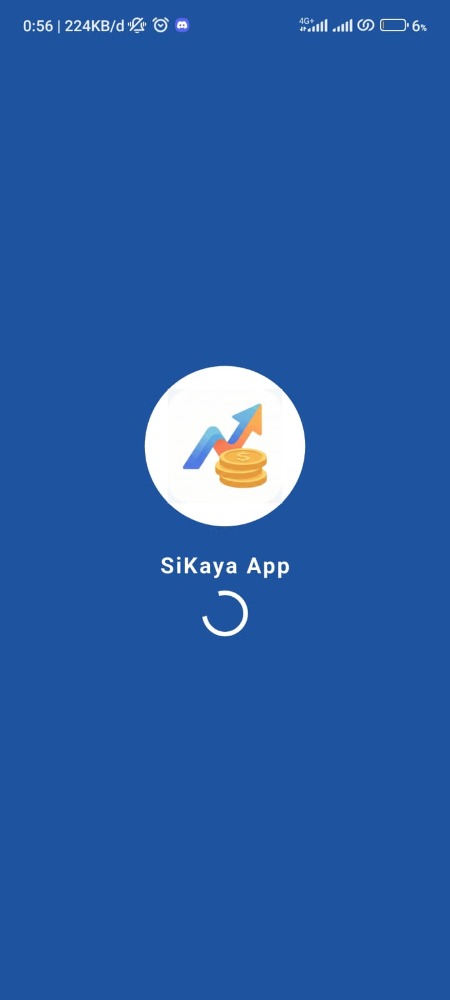
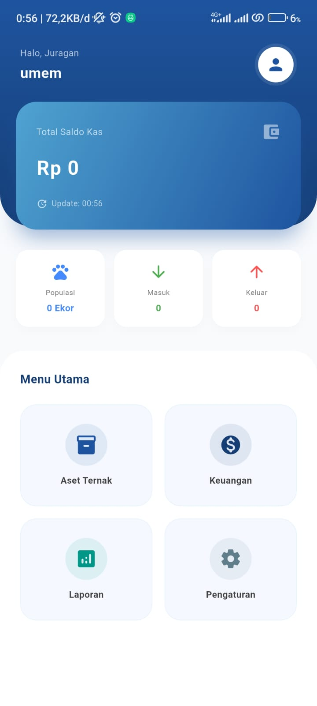
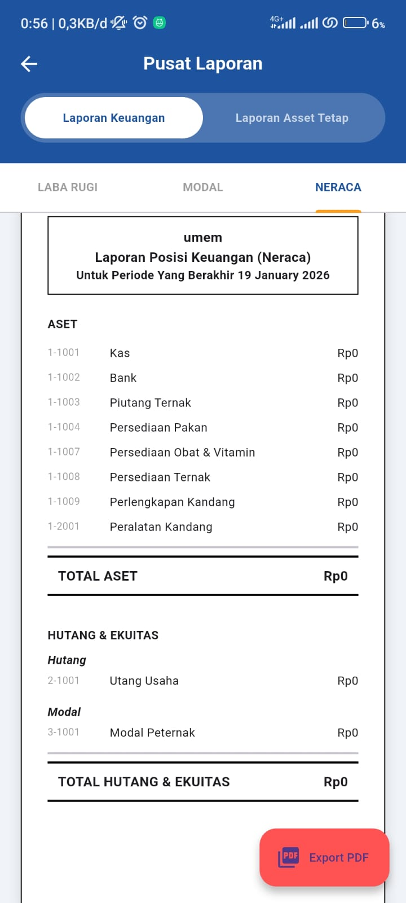

<div align="center">
  
  
  
  
  <br />
  <h1>💰 SiKaya App</h1>
  <p><i>"Manajemen Keuangan dan Aset dalam Satu Genggaman"</i></p>
</div>

---

### 📱 Tentang SiKaya App
**SiKaya App** adalah aplikasi mobile berbasis Flutter yang dirancang untuk memenuhi kebutuhan pengelolaan finansial dan aset secara profesional. Aplikasi ini memungkinkan pengguna untuk melakukan pencatatan transaksi harian sekaligus mengelola aset tetap maupun operasional secara terorganisir.

### ✨ Fitur Utama
- **Dashboard Finansial:** Pantau saldo kas, total pemasukan, dan pengeluaran secara instan.
- **Pusat Laporan:** Laporan Laba Rugi otomatis yang dapat diekspor ke format PDF.
- **Manajemen Aset:** Pengelolaan aset terpadu yang mencakup Ternak, Operasional Habis Pakai, dan Aset Tetap.
- **Sistem Onboarding:** Antarmuka ramah pengguna untuk inisialisasi data peternakan/usaha.
- **Manajemen Data:** Fitur Backup Data (CSV), Tutup Buku, dan Reset Aplikasi untuk keamanan data.

### 🛠️ Tech Stack
- **Framework:** Flutter (Mobile)
- **Language:** Dart
- **Key Implementation:** Laporan Akuntansi (Laba Rugi, Neraca, Modal), Ekspor PDF, dan Manajemen State.

### 📸 Tampilan Aplikasi
| Onboarding | Dashboard | Laporan Keuangan |
| :---: | :---: | :---: |
|  |  |  |


### ⚙️ Instalasi & Penggunaan
1. Clone repositori:
   ```bash
   git clone [https://github.com/Umeem26/Apk-Mobile-Manajemen-Finance-Assets.git](https://github.com/Umeem26/Apk-Mobile-Manajemen-Finance-Assets.git)
2. Instal dependensi:
   ```bash
   flutter pub get
3. Jalankan aplikasi:
   ```bash
   flutter run
